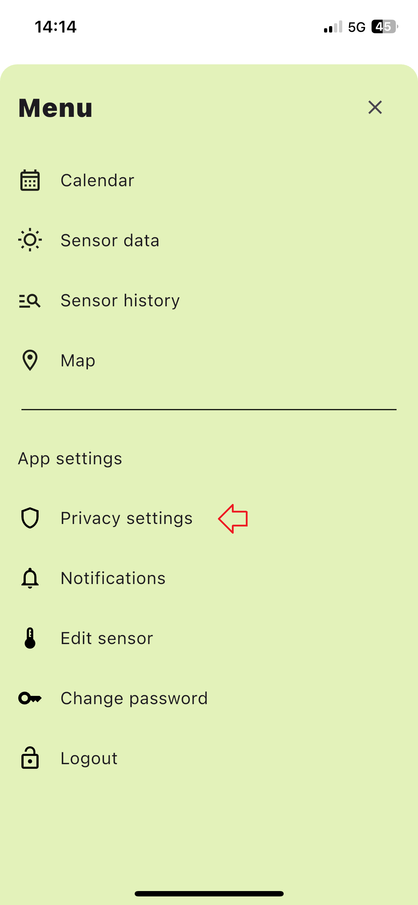
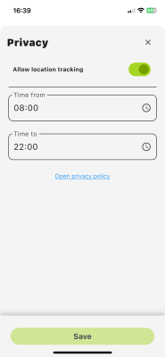
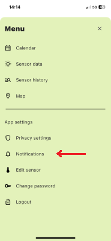
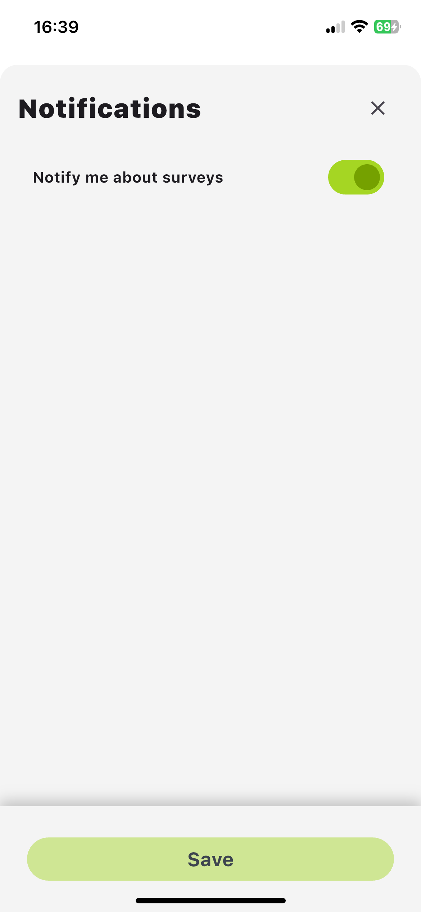
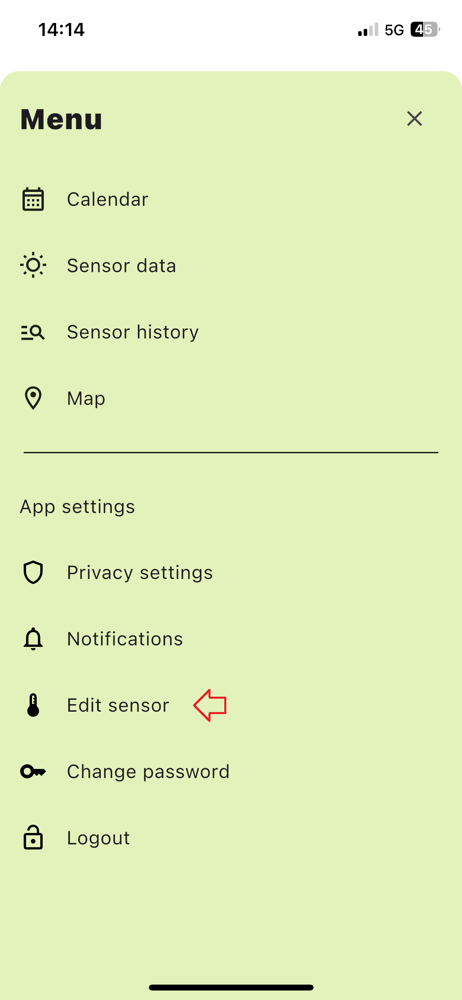
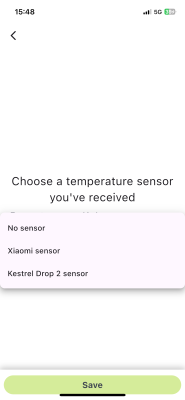
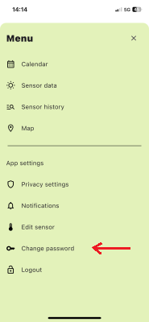
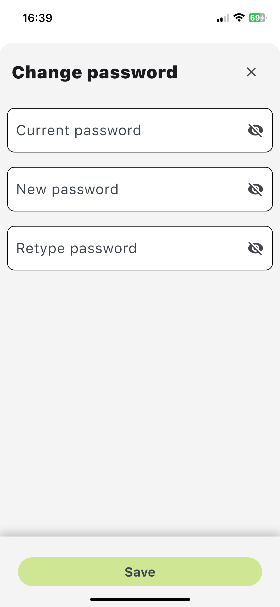
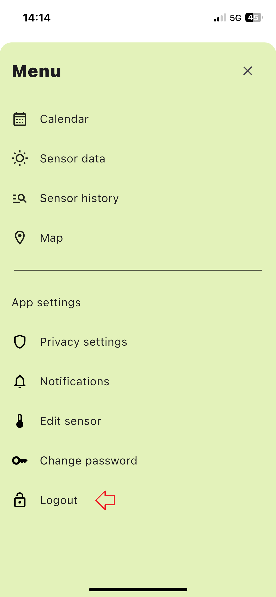
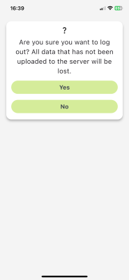

# App settings
The `App Settings` module allows you to configure various preferences, including privacy, notifications, sensor settings, and account management.

## Accessing App Settings
1. Click the menu button on the right side of the screen.
2. Select the appropriate tab from the menu sidebar.

## Privacy settings
You can enable or disable location tracking within specific time ranges:
- Allow location tracking: Set `Time From` and `Time To`.

## Notifications
Enable notifications to receive updates about surveys:
- Notify me about surveys.

## Edit sensor
Modify the sensor settings assigned to your account:
- Choose a temperature sensor you've received

## Change password
Update your account password by providing the current password:
- Current Password is required to change to a new one.

## Logout
Sign out of the UrbEat app using the Logout option.

