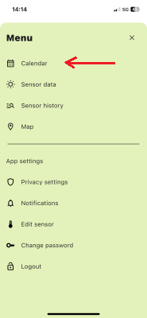
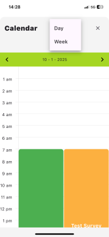
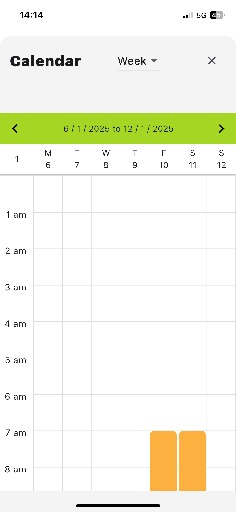
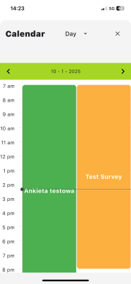

# Calendar
The `Calendar` module provides an overview of all scheduled surveys.

## Accessing the Map Module
1. Click the menu button on the right side of the screen.
2. Select the appropriate tab from the menu sidebar.

### Calendar Viewing Modes
The calendar can be viewed in two modes:
- Day View
- Week View

### Understanding Survey Status
In the calendar, surveys are color-coded based on their status:
- Orange: Surveys not yet completed.
- Green: Surveys already completed.

