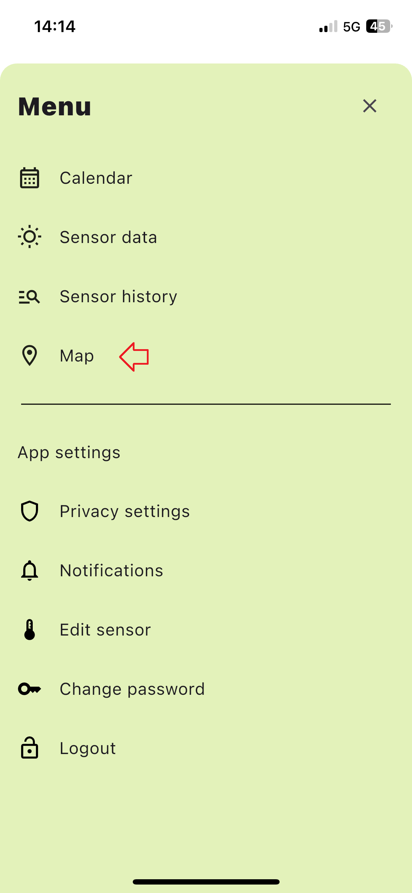
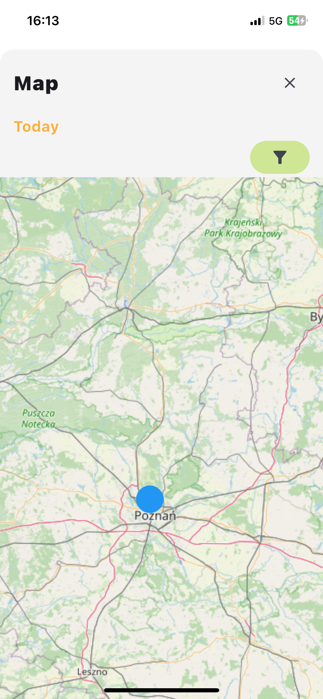
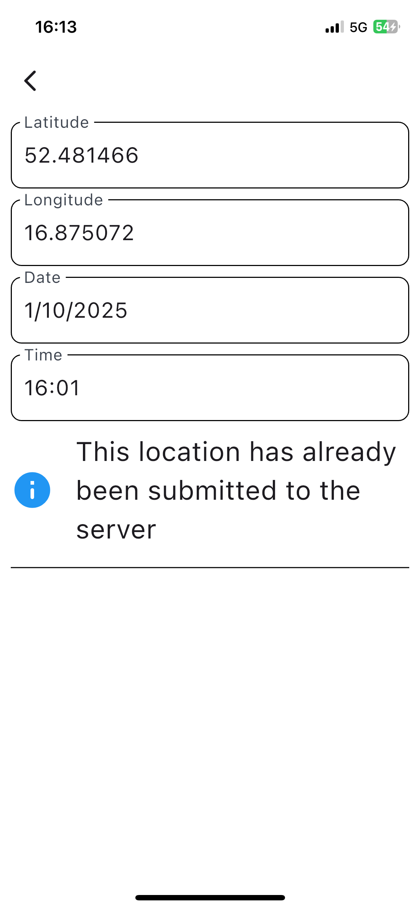
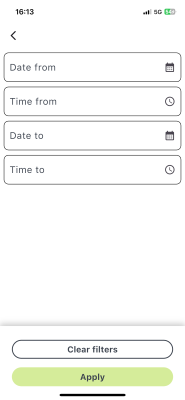

# Map

The `Map` module allows you to view and interact with location data saved in the system.

## Accessing the Map Module
1. Click the menu button on the right side of the screen.
2. Select the appropriate tab from the menu sidebar.

## Viewing Location Data
The map displays all saved location data.

By clicking on a specific location point, you can view detailed information, including:
- Longitude
- Latitude
- Date
- Time
- Status (whether the data has been sent to the server)

### Filtering Localization Data
Use the Filter button to refine your search by:
- Date From
- Time From
- Date To
- Time To

## Color-Coding for Data Status
- **Red**: Indicates location data that has not been sent to the server.
- **Blue**: Indicates location data that has been sent to the server.
