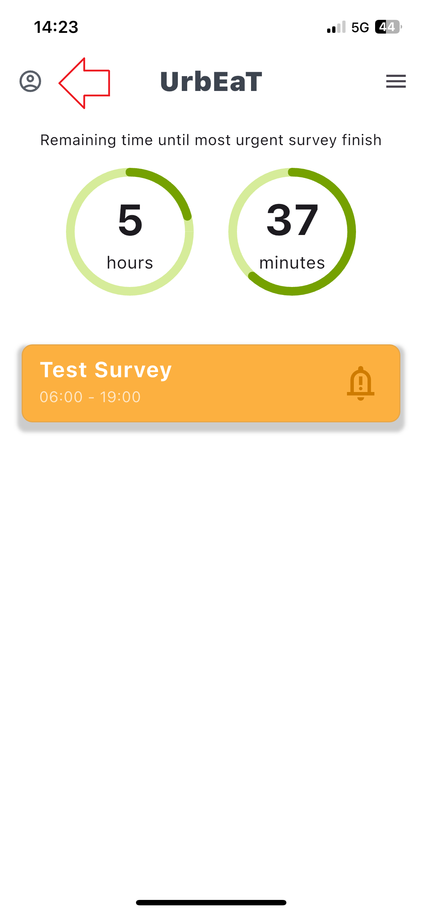
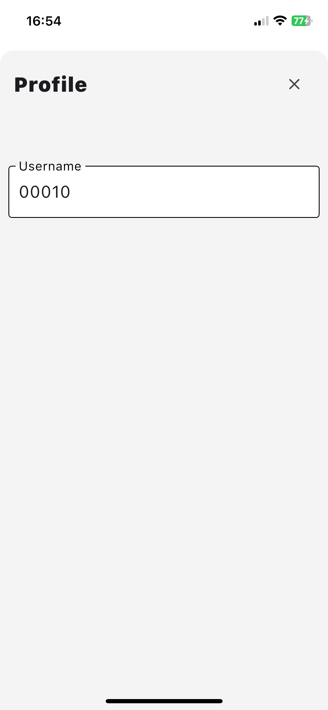

# Profile
The `Profile` module provides an overview of your account details and initial survey responses (if applicable).

## Accessing Profile Module
1. Click the profile button on the left side of the screen.

In this module, you can view:
- Your username.
- All answers provided during the initial survey (if one was completed).

