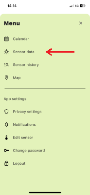
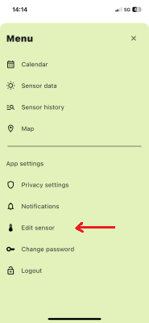
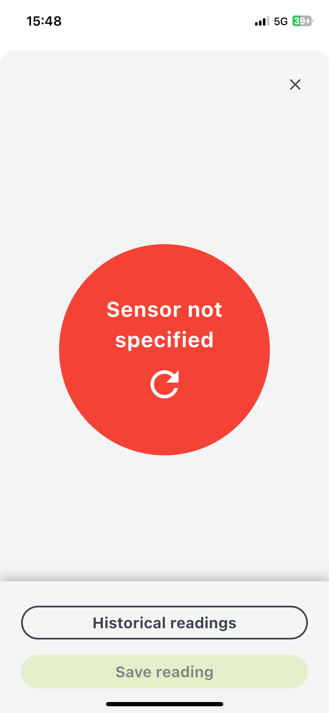
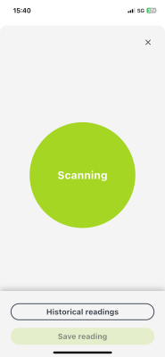
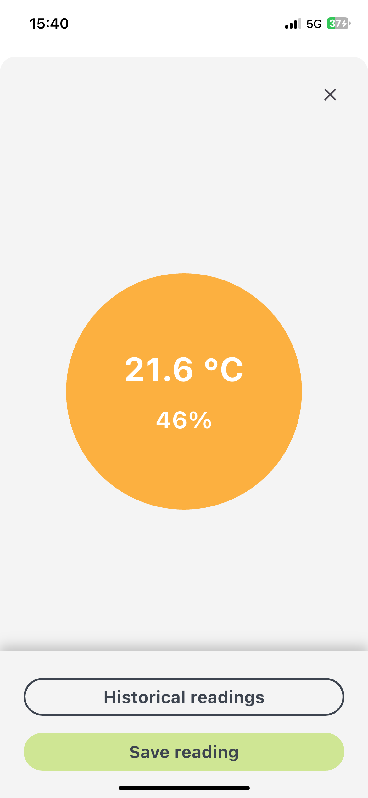
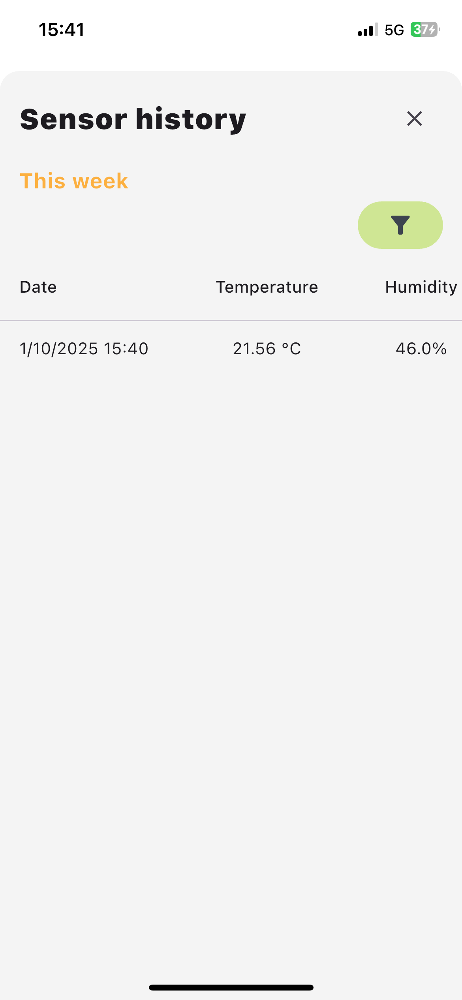
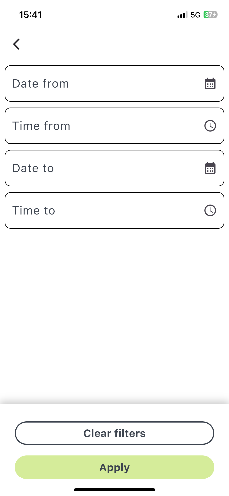
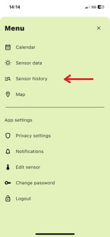

# Sensors

The `Sensors Data` module allows you to monitor and manage temperature and humidity readings from your sensor. Follow these steps to navigate and use the module effectively.

## Accessing the Map Module
1. Click the menu button on the right side of the screen.
2. Select the appropriate tab from the menu sidebar.

## Specifying Your Sensor
Before accessing sensor data, you must specify the sensor assigned to you at the start of the study:
1. Go to the `Edit Sensor` module via the menu.
2. Select and configure your sensor.

If no sensor is specified, you'll see this notification in the `Sensors data` module

## Viewing Sensor Data
In this module, you can view real-time temperature and humidity readings from your sensor.

### Saving Sensor Readings
Click the `Save Reading` button to send the displayed data to the server.

### Historical Readings
To review past sensor data:

Click the `Historical Readings` button in the Sensors Data module to access the Sensor History module.

This module stores all sensor data with details such as:
- Date
- Temperature
- Humidity
- Status (whether the data has been sent to the server)

### Filtering Historical Data
Use the Filter button to refine your search by:
- Date From
- Time From
- Date To
- Time To

### Accessing Sensor History Directly
You can also access the Sensor History module directly from the menu by selecting the appropriate tab.

