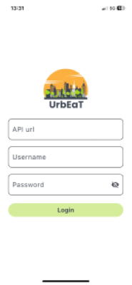
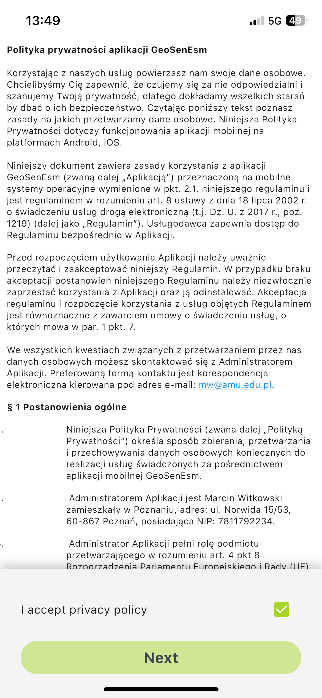
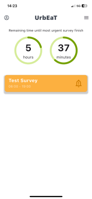

# Signing In

To access the UrbEaT app, you need to log in using credentials provided by the Admin. These credentials can be updated later if needed.
On the login page, enter your credentials:
- **API url**: API url provided by the Admin
- **Username**: The password provided by the Admin
- **Password**: The password provided by the Admin

Then, click the `Log In` button.

## Privacy Policy Agreement
After logging in, you will be redirected to the Privacy Policy page. You must accept the policy to proceed further.

Once completed, you will be redirected to the main page of the UrbEat app.

## Main Screen
On the main screen, you will find:
- A timer showing the remaining time until the most urgent survey expires.
- Orange-colored surveys waiting for you to complete.

