# Completing Survey

Overview of the process of completing a survey in the UrbEat app.

## Accessing the Survey
On the main screen, you will see an orange button with the survey name and the submission date.

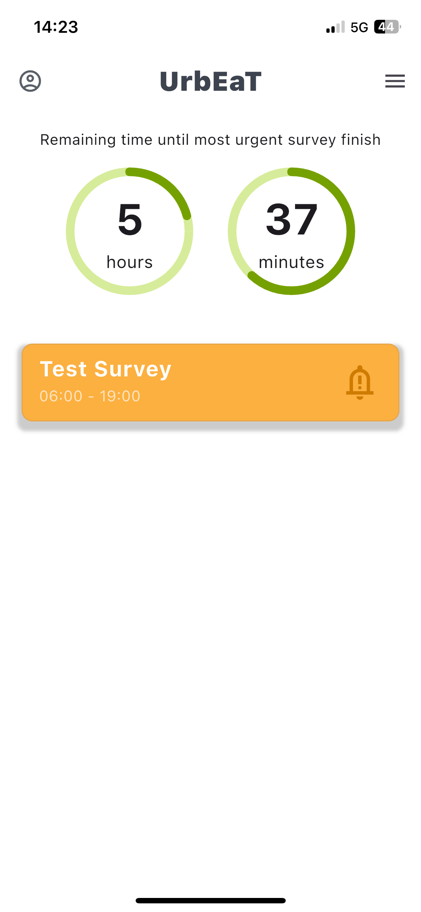

Click on the survey button to begin. You will be redirected to an introductory page that asks, "Do you want to start the survey?"

Click `Start` to proceed to the first question.

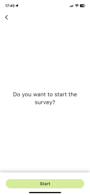

## Different Question Types
The survey will include various question types:
1. Single Choice Question

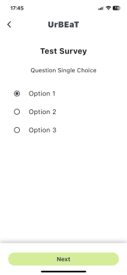

2. Multiple Choice Question

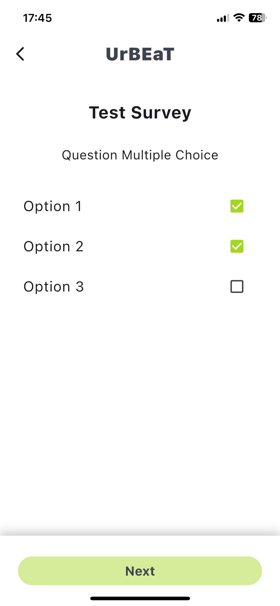

3. Linear Scale Question

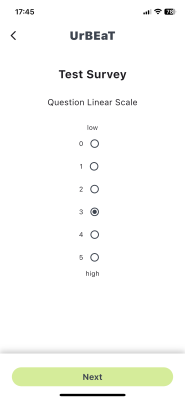

4. Question Yes/No

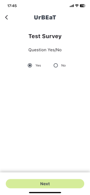

5. Question Number Input

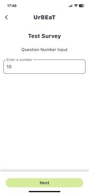

6. Question Text Input

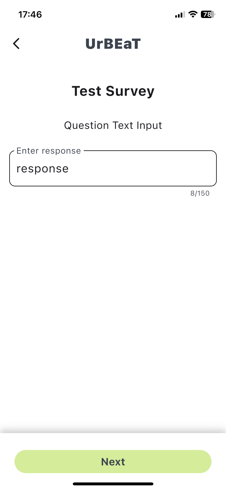

7. Question Image Choice

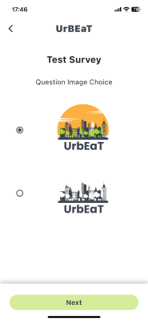

## Completing the Survey
Once you have answered all the questions, the last screen will appear, asking:
"Do you want to end the survey? You will not be able to edit your answers later."

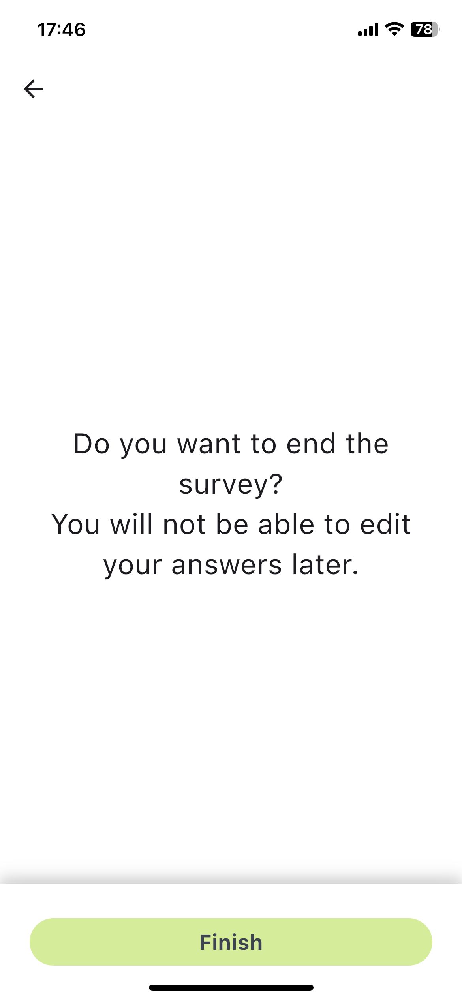

Click `Finish` to submit your survey. You will be redirected back to the main screen, where the survey will no longer be visible as it has been completed.

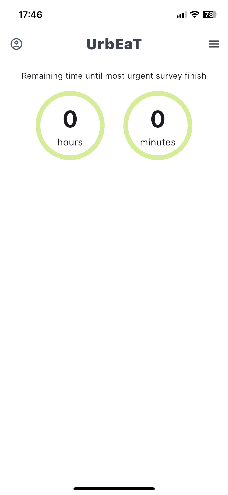
