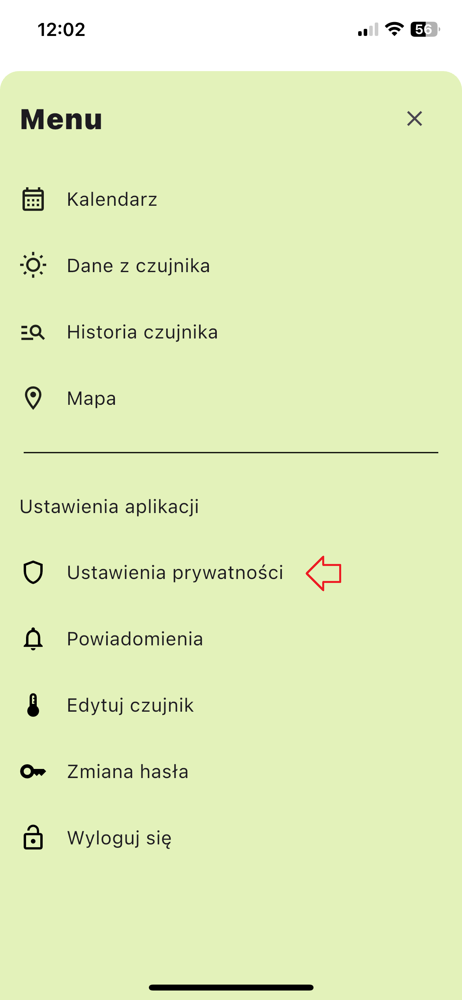
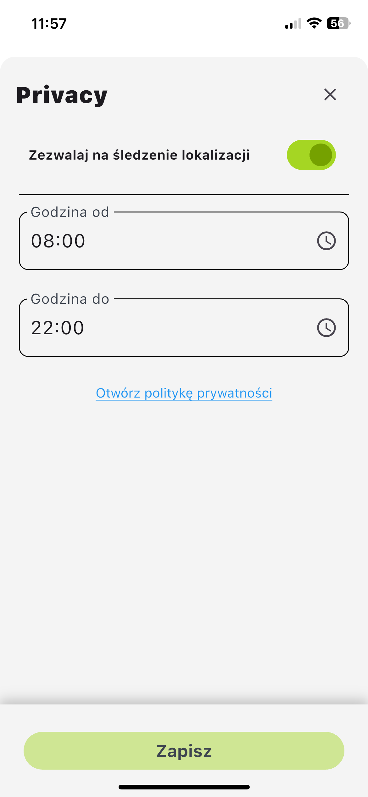
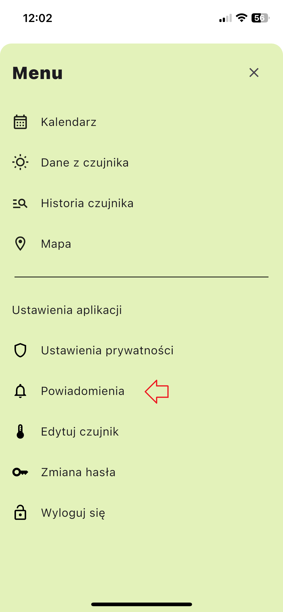
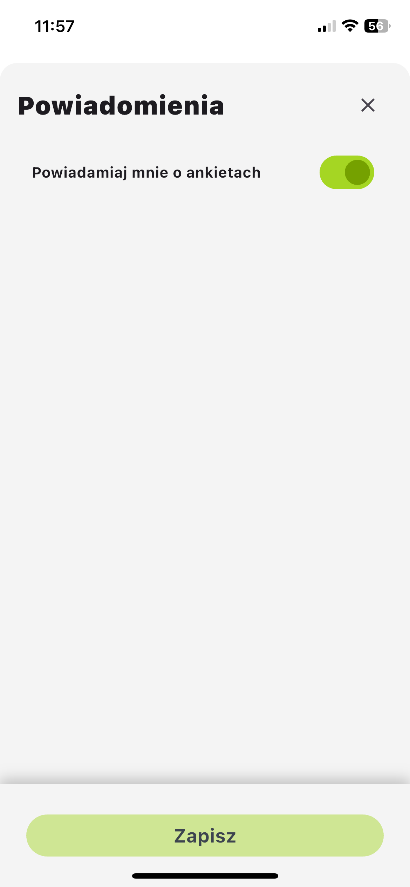
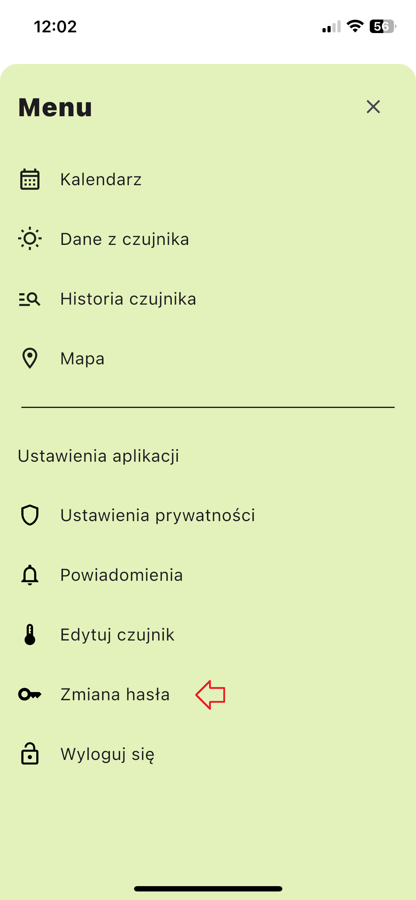
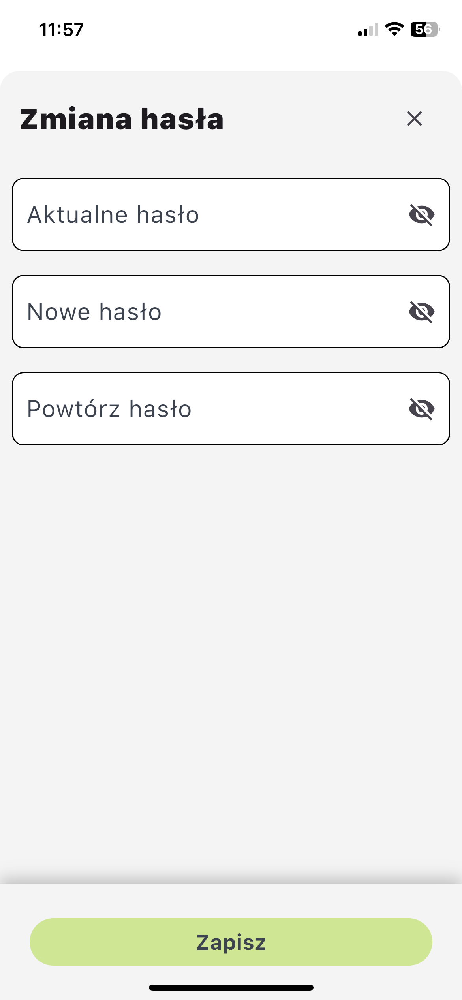
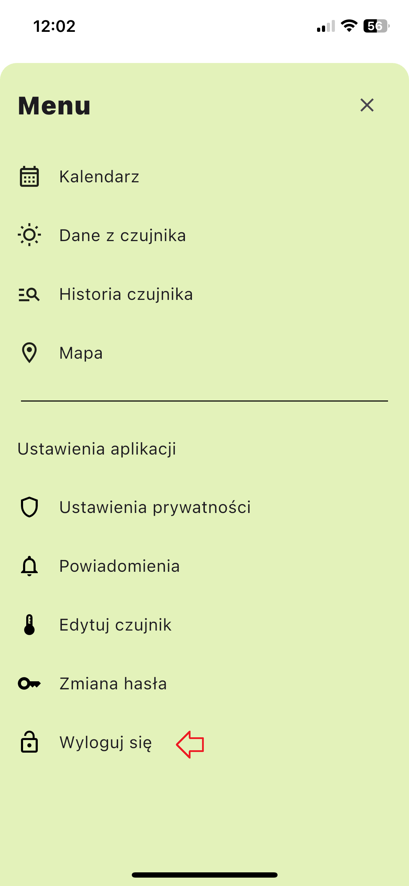
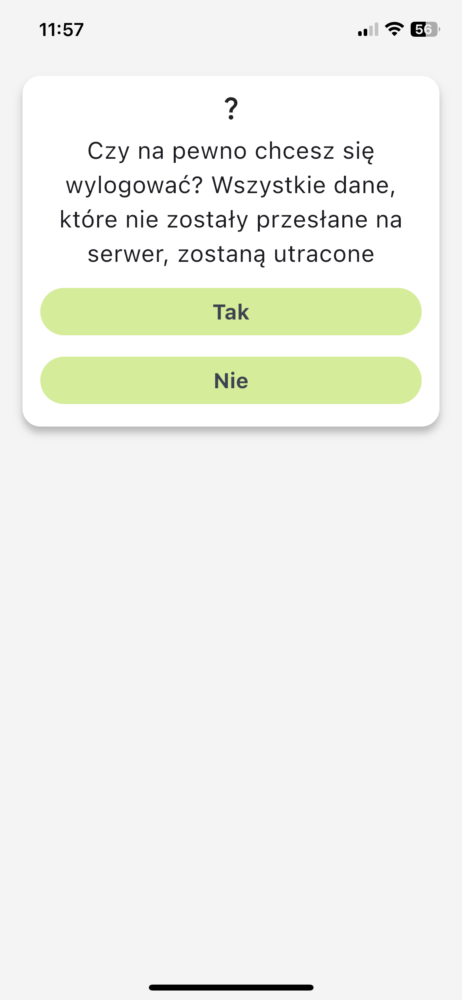

# Ustawienia aplikacji

Moduł `Ustawienia aplikacji` pozwala na konfigurację różnych preferencji, takich jak prywatność, powiadomienia, ustawienia czujników oraz zarządzanie kontem.

## Dostęp do ustawień aplikacji
1. Kliknij przycisk menu po prawej stronie ekranu.
2. Wybierz odpowiednią kartę z paska bocznego menu.

## Ustawienia prywatności
Możesz włączyć lub wyłączyć śledzenie lokalizacji w określonych przedziałach czasowych:
- Zezwól na śledzenie lokalizacji: Ustaw `Czas od` i `Czas do`.

## Powiadomienia
Włącz powiadomienia, aby otrzymywać informacje o ankietach:
- Powiadamiaj mnie o ankietach.

## Edytuj czujnik
Zmodyfikuj ustawienia czujnika przypisanego do Twojego konta:
- Wybierz czujnik temperatury, który otrzymałeś.

## Zmień hasło
Zaktualizuj hasło do swojego konta, podając obecne hasło:
- Obecne hasło jest wymagane do zmiany na nowe.

## Wyloguj się
Wyloguj się z aplikacji UrbEat, korzystając z opcji Wyloguj.

