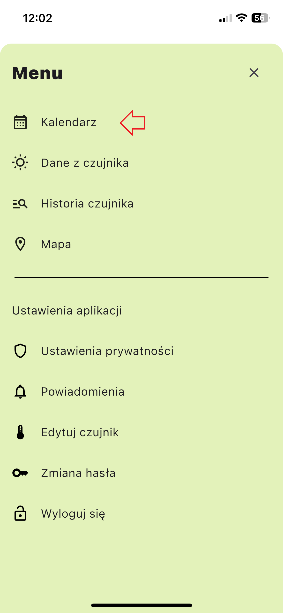
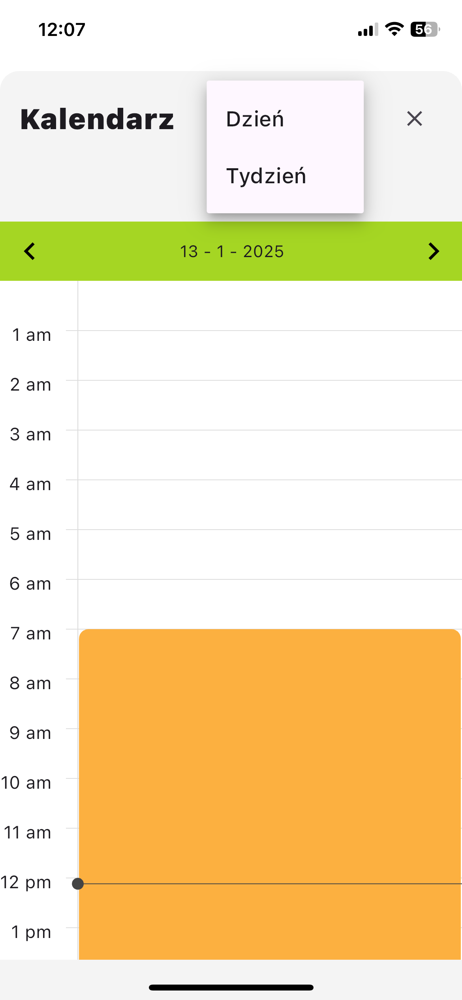
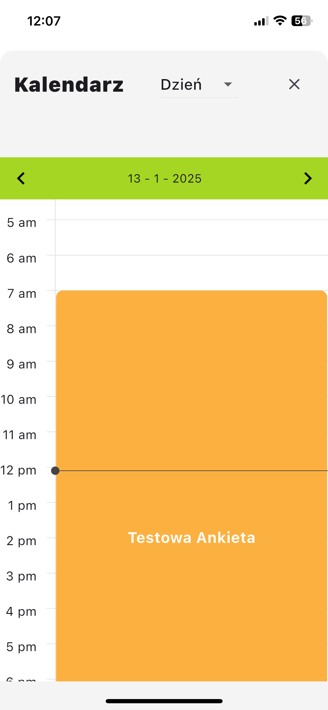
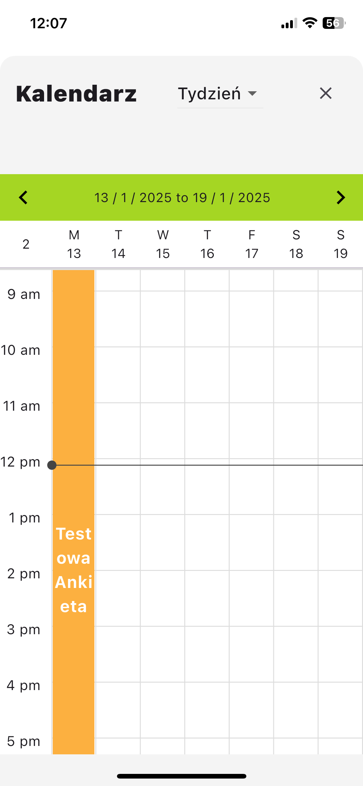

# Kalendarz

Moduł `Kalendarz` zapewnia przegląd wszystkich zaplanowanych ankiet.

## Dostęp do modułu Kalendarz
1. Kliknij przycisk menu po prawej stronie ekranu.
Wybierz odpowiednią kartę z paska bocznego menu.

### Tryby wyświetlania kalendarza
Kalendarz można wyświetlać w dwóch trybach:
- Widok dzienny
- Widok tygodniowy

### Interpretacja statusu ankiet
W kalendarzu ankiety są oznaczone kolorami w zależności od ich statusu:
- **Zielony**: Ankiety wypełnione.
- **Pomarańczowy**: Ankiety oczekujące na wypełnienie.
- **Czerwony**: Ankiety pominięte (niewypełnione).
