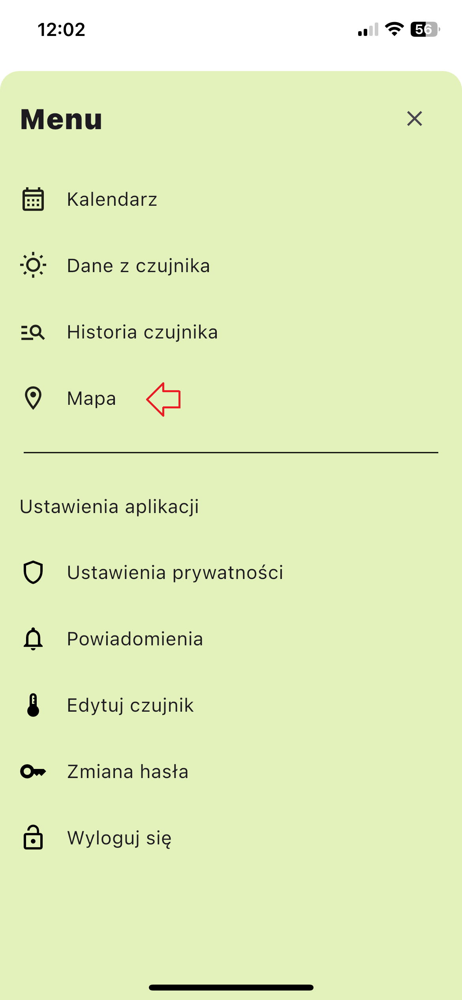
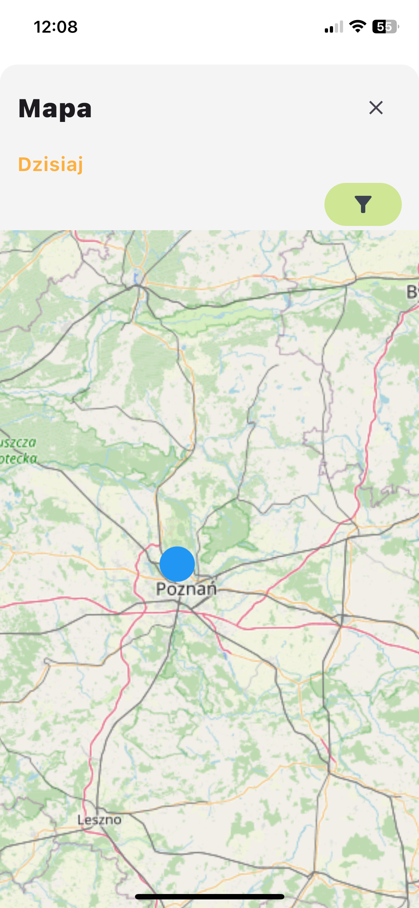
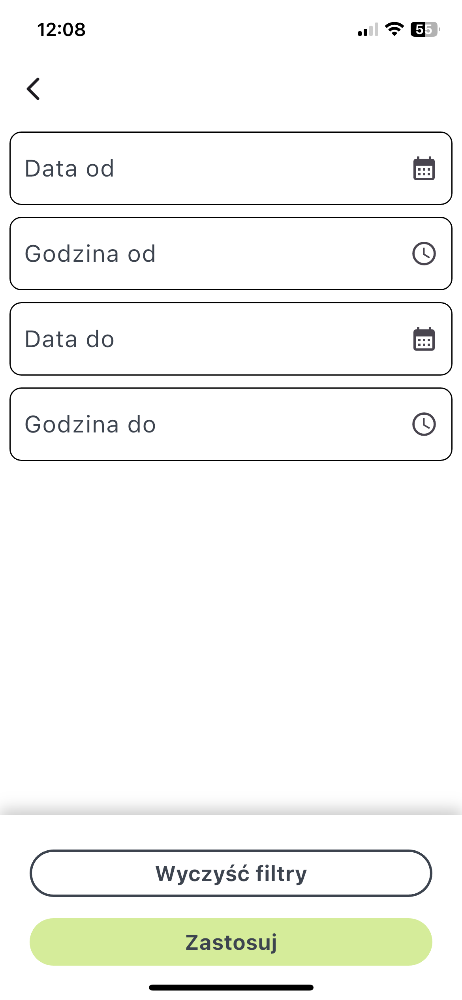

# Mapa

Moduł `Mapa` umożliwia przeglądanie i interakcję z danymi lokalizacyjnymi zapisanymi w systemie.

## Dostęp do modułu Mapy
1. Kliknij przycisk menu po prawej stronie ekranu.
2. Wybierz odpowiednią kartę z paska bocznego menu.

## Przeglądanie danych lokalizacyjnych
Mapa wyświetla wszystkie zapisane dane lokalizacyjne.

Klikając na wybrany punkt lokalizacyjny, możesz zobaczyć szczegółowe informacje, w tym:
- Długość geograficzną
- Szerokość geograficzną
- Datę
- Czas
- Status (czy dane zostały wysłane na serwer)

### Filtrowanie danych lokalizacyjnych
Użyj przycisku Filtr, aby zawęzić wyszukiwanie według:
- Data od
- Godzina od
- Data do
- Godzina do

## Kodowanie kolorami dla statusu danych
- Czerwony: Wskazuje dane lokalizacyjne, które nie zostały wysłane na serwer.
- Niebieski: Wskazuje dane lokalizacyjne, które zostały wysłane na serwer.