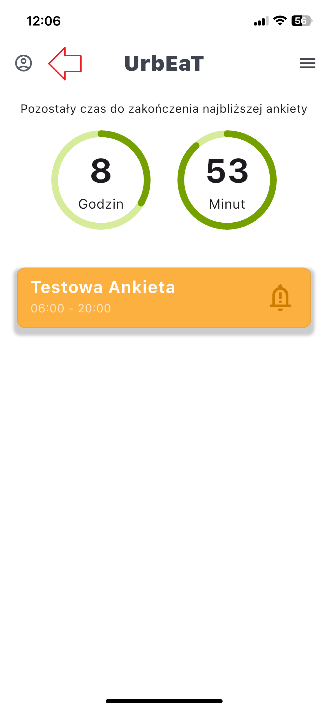
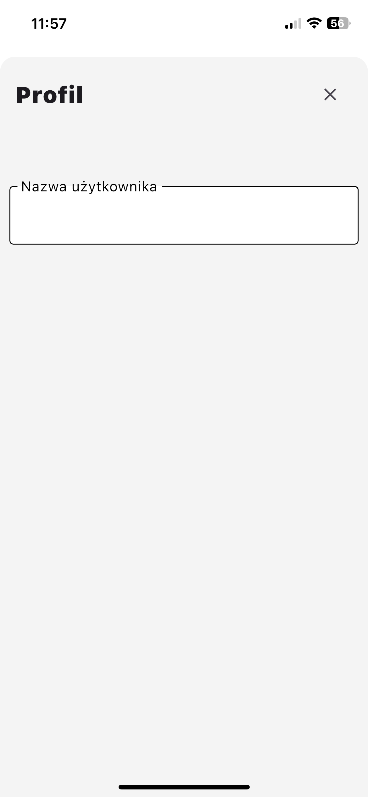

# Profil

Moduł `Profil` zapewnia przegląd szczegółów Twojego konta oraz odpowiedzi z wstępnej ankiety (jeśli została wypełniona).

## Dostęp do modułu Profil
1. Kliknij przycisk profilu po lewej stronie ekranu.

W tym module możesz zobaczyć:
- Swoją nazwę użytkownika.
- Wszystkie odpowiedzi udzielone w wstępnej ankiecie (jeśli została wypełniona).

