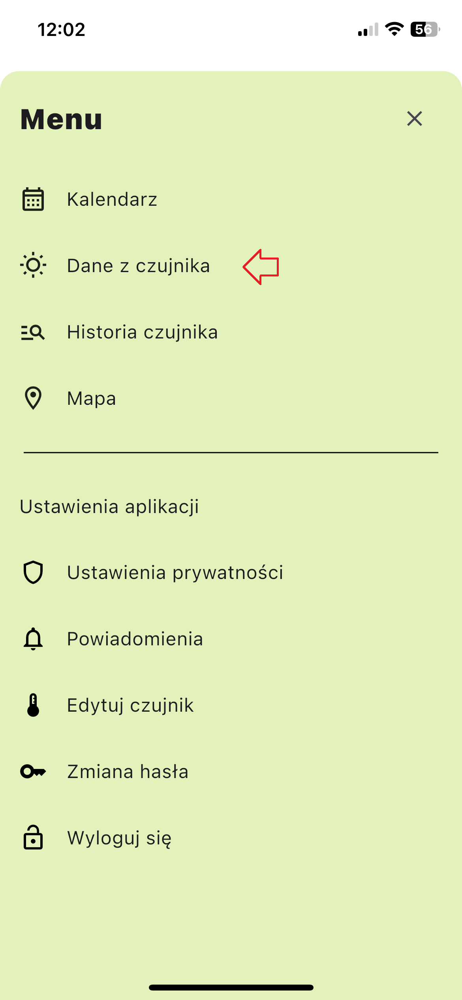
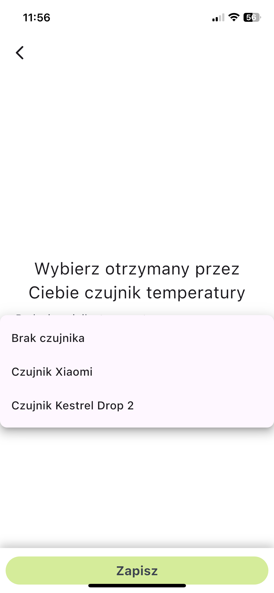
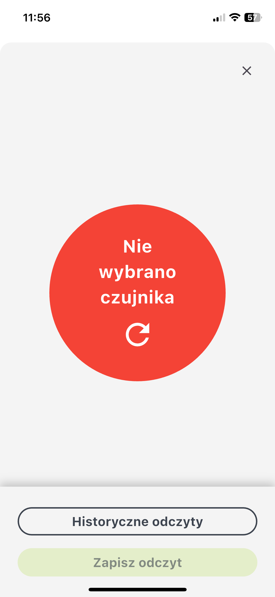
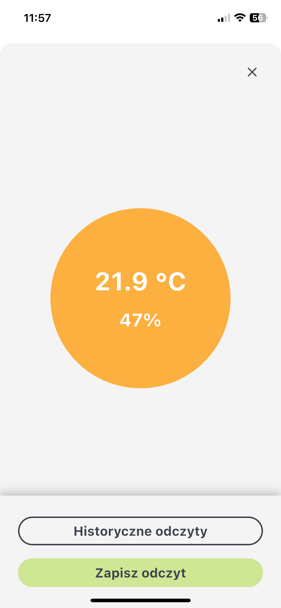
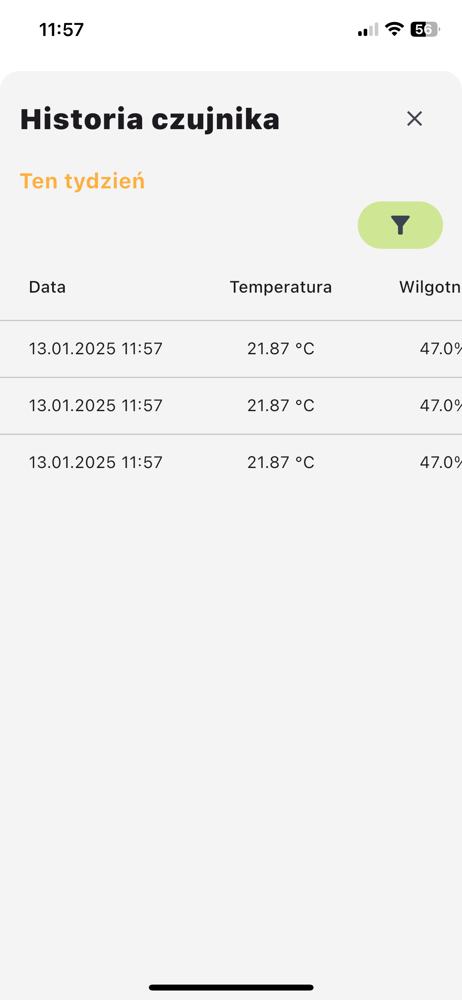
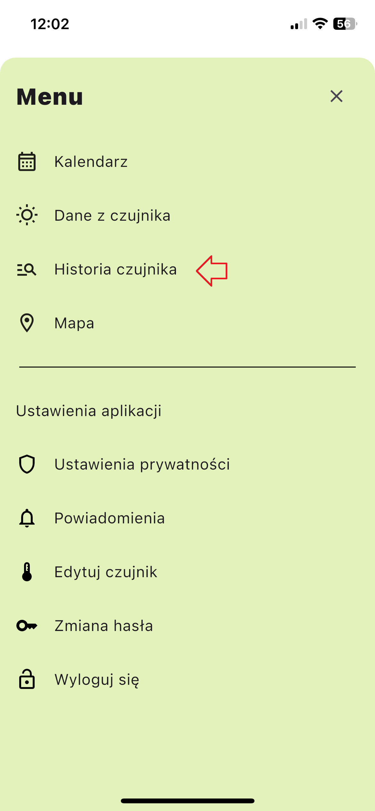

# Czujniki

Moduł `Dane z czujnika` umożliwia monitorowanie i zarządzanie odczytami temperatury i wilgotności z Twojego czujnika. Postępuj zgodnie z poniższymi instrukcjami, aby skutecznie korzystać z modułu.

## Dostęp do Modułu Dane z Czujnika
1. Kliknij przycisk menu po prawej stronie ekranu.
2. Wybierz odpowiednią zakładkę z paska menu.

## Wybór Twojego Czujnika
Przed uzyskaniem dostępu do danych czujnika musisz określić czujnik przypisany do Ciebie na początku badania:
1. Przejdź do modułu `Edytuj Czujnik` za pomocą menu.
2. Wybierz i skonfiguruj swój czujnik.

Jeśli nie określisz czujnika, zobaczysz następujące powiadomienie w module `Dane z czujnika`.

## Wyświetlanie Danych Czujników
W tym module możesz przeglądać odczyty temperatury i wilgotności w czasie rzeczywistym.

### Zapisywanie Odczytów Czujnika
Kliknij przycisk `Zapisz Odczyt`, aby wysłać wyświetlane dane na serwer.

### Historia czujnika
Aby przejrzeć wcześniejsze odczyty czujnika:

Kliknij przycisk `Historyczne odczyty` w module Dane z Czujnika, aby przejść do modułu Historia Czujników.

Ten moduł przechowuje wszystkie dane czujnika wraz ze szczegółami, takimi jak:
- Data
- Temperatura
- Wilgotność
- Status (czy dane zostały wysłane na serwer)

### Filtrowanie Danych Historycznych
Użyj przycisku Filtruj, aby zawęzić wyszukiwanie według:
- Data Od
- Godzina Od
- Data Do
- Godzina Do

### Bezpośredni Dostęp do Historii Czujników
Możesz także bezpośrednio uzyskać dostęp do modułu Historia Czujników, wybierając odpowiednią zakładkę w menu.

