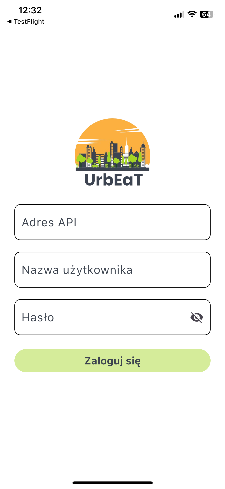
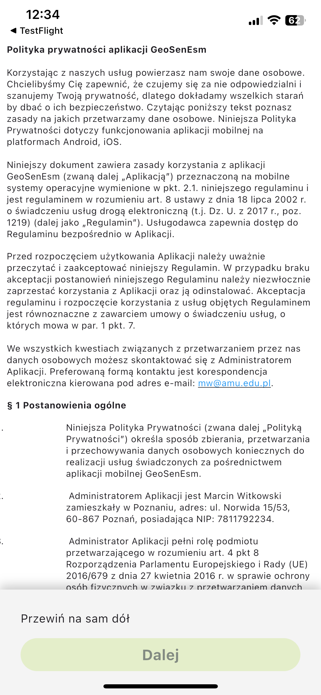

# Logowanie

Aby uzyskać dostęp do aplikacji **UrbEaT**, musisz zalogować się, używając danych uwierzytelniających dostarczonych przez administratora. Dane te można zaktualizować w późniejszym czasie, jeśli zajdzie taka potrzeba.

Na stronie logowania wprowadź swoje dane uwierzytelniające:
- **Adres API**: Adres API dostarczony przez administratora
- **Nazwa użytkowanika**: Nazwa użytkownika dostarczona przez administratora
- **Hasło**: Hasło dostarczone przez administratora

Następnie kliknij przycisk `Zaloguj się`.

## Akceptacja Polityki Prywatności
Po zalogowaniu zostaniesz przekierowany na stronę Polityki Prywatności. Aby kontynuować, musisz zaakceptować politykę.

Po zaakceptowaniu zostaniesz przekierowany na główną stronę aplikacji UrbEaT.

## Ekran główny
Na ekranie głównym znajdziesz:
- Zegar odliczający czas do wygaśnięcia najpilniejszej ankiety.
- Ankiety oznaczone kolorem pomarańczowym, które czekają na wypełnienie.

