# Wypełnianie ankiety

Przegląd procesu wypełniania ankiety w aplikacji UrbEaT.

## Dostęp do ankiety
Na głównym ekranie zobaczysz pomarańczowy przycisk z nazwą ankiety oraz godzinami, w których ankieta jest dostępna.

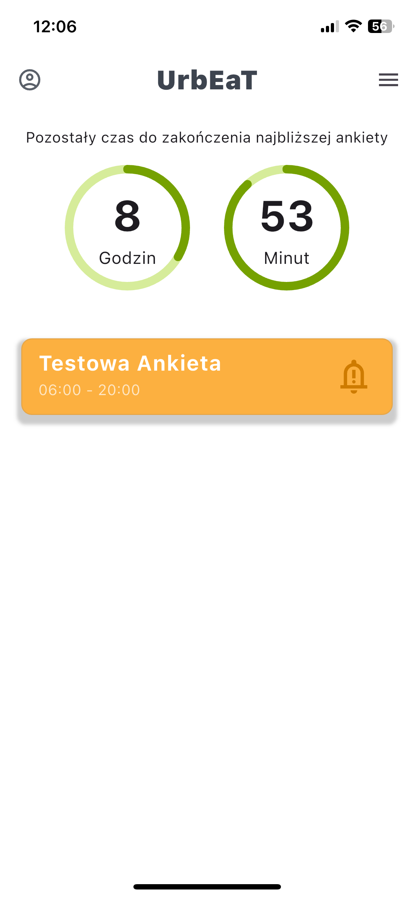

Kliknij przycisk ankiety, aby rozpocząć. Zostaniesz przekierowany na stronę wstępną, która zapyta: "Czy chcesz rozpocząć ankietę?"

Kliknij `Rozpocznij`, aby przejść do pierwszego pytania.

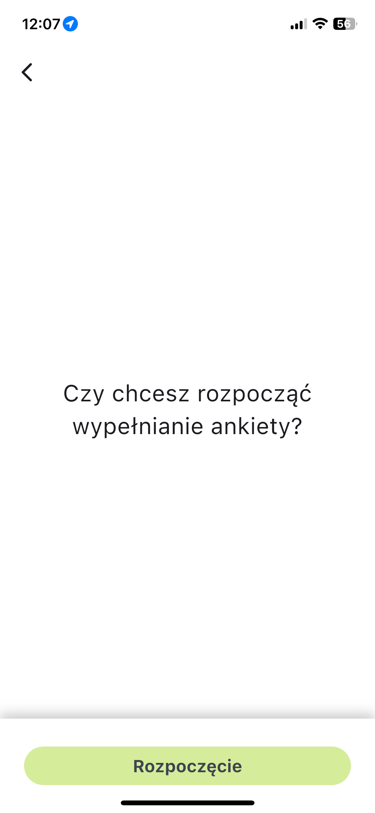

## Różne typy pytań
Ankieta może zawierać różne typy pytań:

1. Pytanie jednokrotnego wyboru

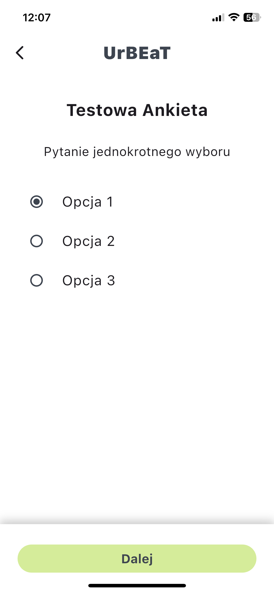

2. Pytanie wielokrotnego wyboru

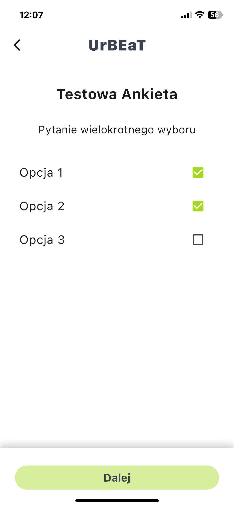

3. Pytanie ze skalą liniowa

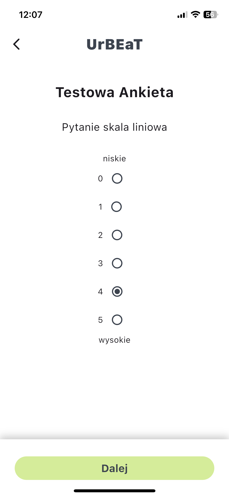

4. Pytanie Tak/Nie

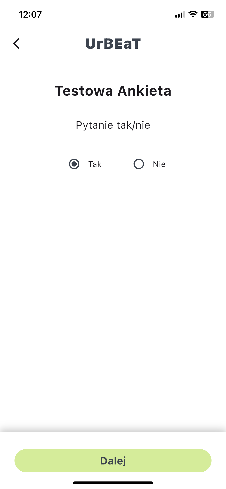

5. Pytanie numeryczne

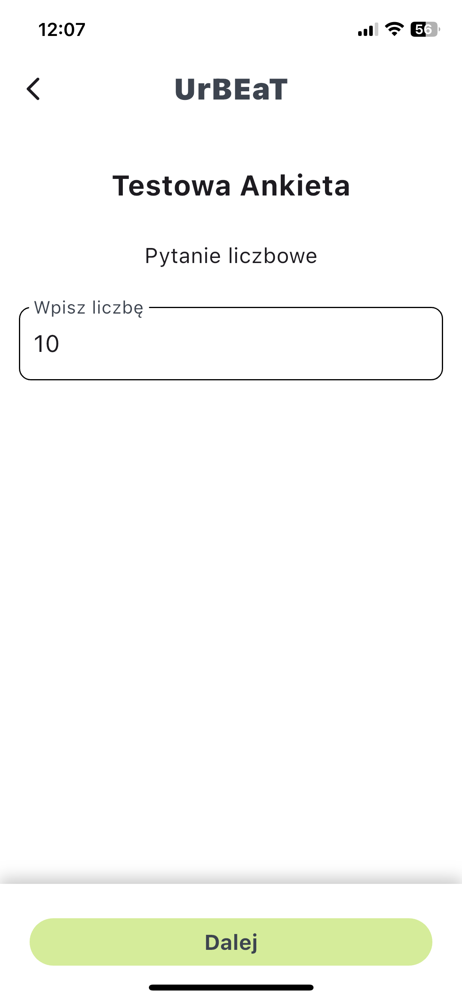

6. Pytanie tekstowe

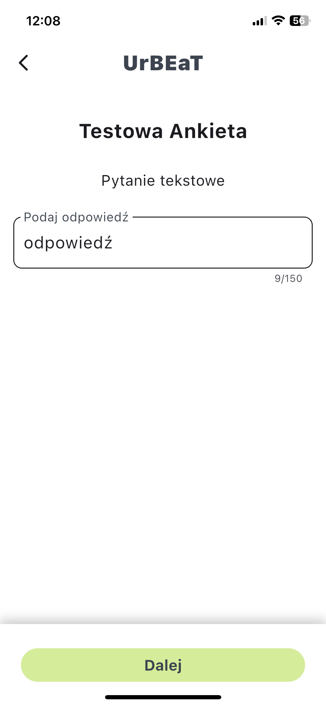

7. Pytanie obrazkowe

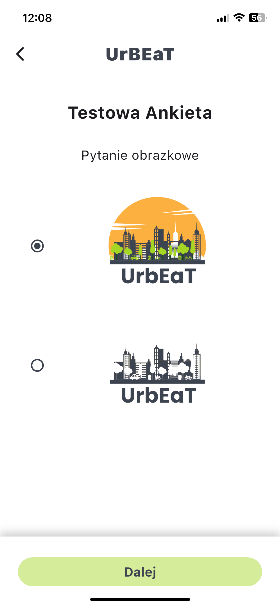

## Zakończenie ankiety
Po udzieleniu odpowiedzi na wszystkie pytania pojawi się ostatni ekran, który zapyta: „Czy na pewno chcesz zakończyć ankietę? Nie będziesz mógł edytować swoich odpowiedzi później.”

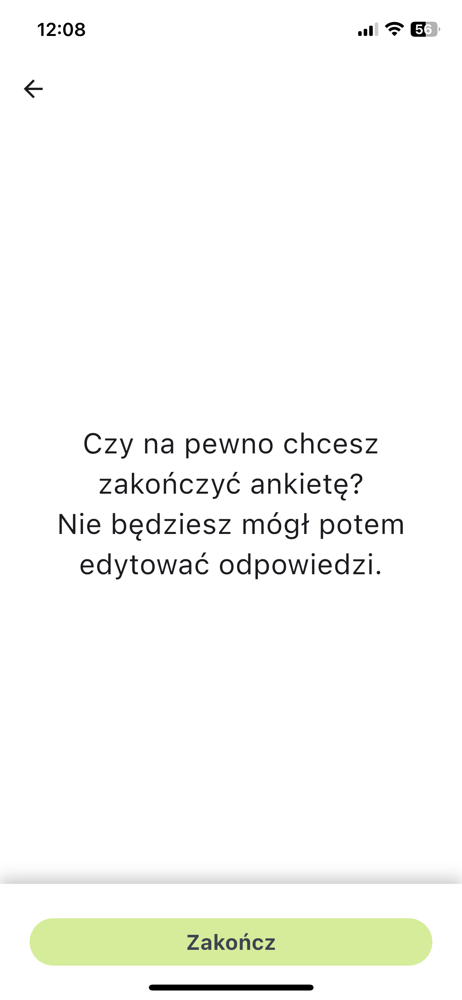

Kliknij `Zakończ`, aby wysłać swoją ankietę. Zostaniesz przekierowany z powrotem na główny ekran, gdzie ankieta nie będzie już widoczna, ponieważ została zakończona.

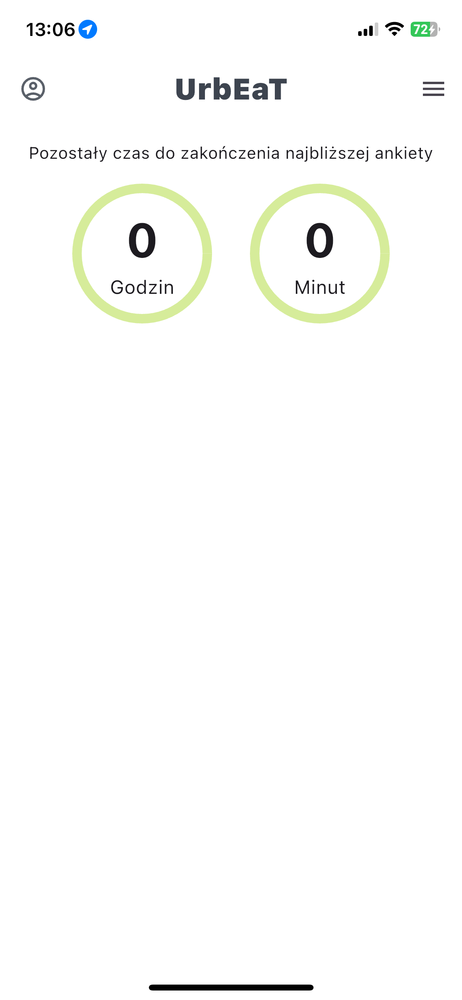
